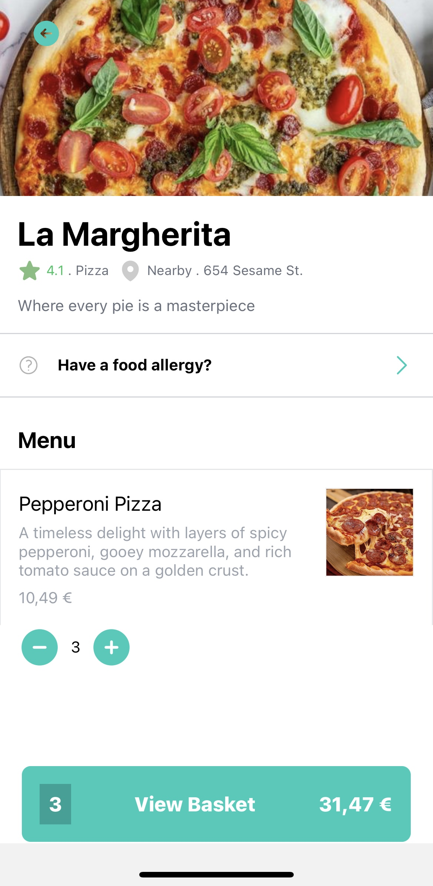
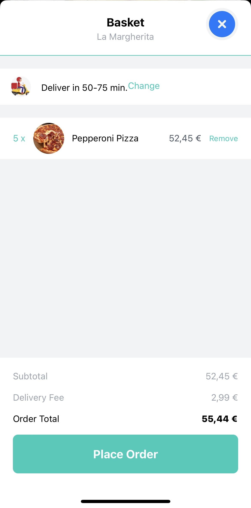
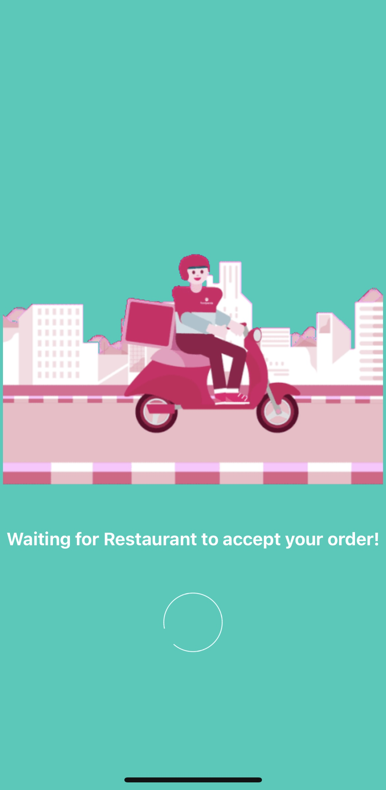
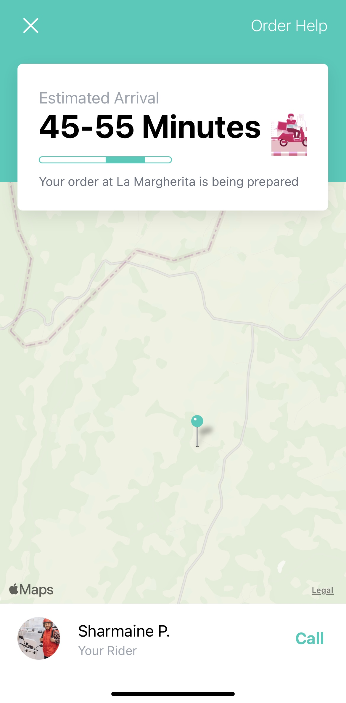

<h1 align="left">Urban Meals App</h1>

###

Urban Meals App is a React Native mobile application, integrating SanityCMS for dynamic content management, GROQ for efficient data querying, Redux for state management, alongside TailwindCSS for stylish and responsive UI design, and robust navigation capabilities.

###

<h2 align="left">Key Features</h2>

###

  - Cross-Platform Efficiency: Built with React Native, the app offers a native experience across both iOS and Android platforms. 
  - Dynamic Content with SanityCMS: Leveraging SanityCMS, the app efficiently manages and serves real-time content, making it adaptable and versatile. 
  - Optimized Data Fetching with GROQ: Utilizing GROQ's powerful querying, the app ensures performance and scalability by fetching precisely what's needed. 
  - State Management with Redux: Ensures a predictable and manageable state architecture, essential for maintaining the app's stability and ease of debugging. 
  - Elegant UI with TailwindCSS: The utility-first CSS framework empowers the app with a custom, consistent, and responsive design. 
  - Seamless Navigation: Incorporates advanced navigation solutions to enhance user experience and interface flow.

###

<h2 align="left">Technologies Used:</h2>

###

  
  
  
  
  
  
  

###

<h2 align="left">Screenshots</h2>

  
  
  
  
  

###

